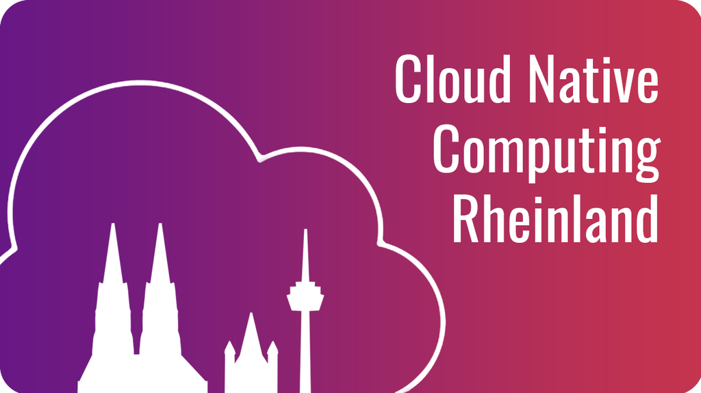

# Cloud Native Computing Rheinland Meetup

Welcome to the Cloud Native Computing Rheinland Meetup's Github repository. Here you can find slides for our past events. They are organised after event date. To find our current events and annoucements go to our [Meetup page](https://www.meetup.com/cloud-native-computing-rheinland) directly.

## Want to speak about a Cloud topic at our meetup?

Very cool. We are always looking for speakers. You can find our contact details below. 

## Want to host this meetup at your company?

Awesome. Our idea is to bring the Meetup to new places. If you want to host and sponsor drinks and snacks, please get in touch. 

## Contact us

* [David Dasenbrook](https://www.linkedin.com/in/daviddasenbrook/) 
* [Christian Siebmanns](https://www.linkedin.com/in/christian-siebmanns/)
* [Marius Stein](https://www.linkedin.com/in/marius-stein-it/)

